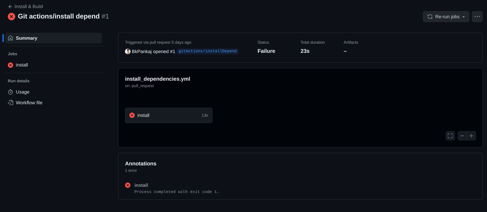

From here onwards Coding period begins, During the Monday meeting, mentors discussed the blocks in VisualCircuit resources and initial tests with GitHub Actions. Additionally, I had some doubts about the VC resources repository, which were clarified by the mentors.

## Goals
- [x] Add basic test with Github Actions.
- [x] Modify and add the blocks in VisualCircuit resources.

## Accomplishment and Challenges

* #### First yaml file for Github Actions
First of all, it was my first time writing a YAML file for GitHub Actions. I used resources such as YouTube videos [1] and GitHub Actions documentation [2]  to help me write the initial script. From the discussions, it was clear that testing should trigger when there is a pull request to the master branch, so I started with that and followed the VisualCircuit documentation for the frontend installation.

First failure of coding period:



* #### Creating workflow for installation process
The initial idea was to create a separate workflow for the installation process. This installation workflow would be reused for every test and other workflows. I worked on this and resolved the above issue by including '--legacy-peer-deps' at the end of the 'npm install' command.

```shell
name: Install and Build

on:
  pull_request:
    branches:
      - 'master'

jobs:
  install:
    runs-on: ubuntu-latest

    steps:
      - name: Checkout code
        uses: actions/checkout@v4

      - name: Set up Node.js
        uses: actions/setup-node@v4
        with:
          node-version: '16'

      - name: Set up Python
        uses: actions/setup-python@v5
        with:
          python-version: '3.x' 

      - name: Install NPM dependencies
        working-directory: frontend
        run: npm install --legacy-peer-deps

      - name: Create virtual environment
        run: python -m venv .venv

      - name: Activate virtual environment
        run: source .venv/bin/activate

      - name: Install dependencies
        run: |
          python -m pip install --upgrade pip
          pip install -r backend/requirements.txt
      - name: Add .env file
        run: cp backend/.env.template backend/.env

      - name: Generate static files
        run: python backend/manage.py collectstatic
```
* #### Research and modifying the workflow 
I reviewed some open source projects such as RocketChat and Volto by the Plone Foundation to understand the CI pipeline workflow. I realized that creating a separate workflow for installation is uncommon and not a best practice. Instead, I created a setup job and stored the results in artifacts for use in different tests (jobs).

Initially, I encountered a "MODULE NOT FOUND" frontend error because I stored node modules in artifacts. Storing node modules in artifacts is not ideal since artifacts are typically used for build files. Stack Overflow and GitHub Actions documentation [3] suggested using Action Cache instead. After switching to Action Cache, the issue was resolved, and I proceeded to the next step of basic frontend testing.

* #### CI Workflow with basic frontend test 
For basic frontend testing, I researched Jest and React testing frameworks commonly used for unit tests on the React side. I used prebuilt React tests and initially printed the rendered HTML in the terminal. Based on this, I identified the menubar elements and added a basic test to find and verify that the "File" text is present in the rendered App.

CI Workflow tested in forked repo:


## PRs created
1. [https://github.com/JdeRobot/VisualCircuit/pull/306](https://github.com/JdeRobot/VisualCircuit/pull/306)
2. [https://github.com/JdeRobot/VisualCircuit/pull/307](https://github.com/JdeRobot/VisualCircuit/pull/307)
3. [https://github.com/JdeRobot/VisualCircuit/pull/308](https://github.com/JdeRobot/VisualCircuit/pull/308)
4. [https://github.com/JdeRobot/VisualCircuit/pull/309](https://github.com/JdeRobot/VisualCircuit/pull/309)

## Resources
1. [https://www.youtube.com/playlist?list=PL9ok7C7Yn9A-6uidd3RXZPf5EfhxkPXa_](https://www.youtube.com/playlist?list=PL9ok7C7Yn9A-6uidd3RXZPf5EfhxkPXa_)
2. [https://docs.github.com/en/actions/learn-github-actions/understanding-github-actions](https://docs.github.com/en/actions/learn-github-actions/understanding-github-actions)
3. [https://docs.github.com/en/actions/using-workflows/caching-dependencies-to-speed-up-workflows](https://docs.github.com/en/actions/using-workflows/caching-dependencies-to-speed-up-workflows)