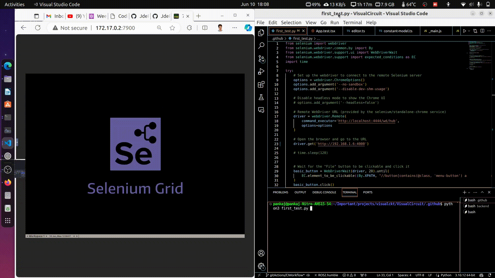
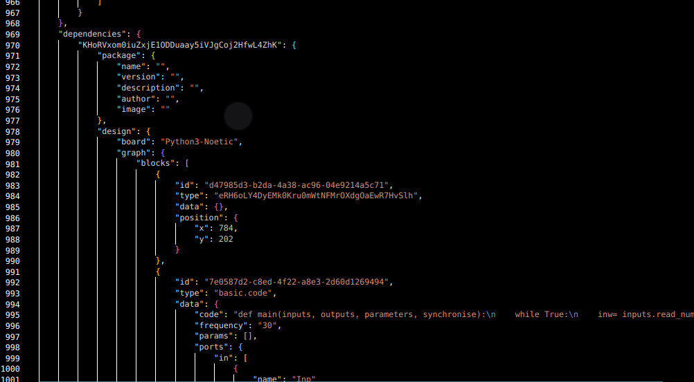
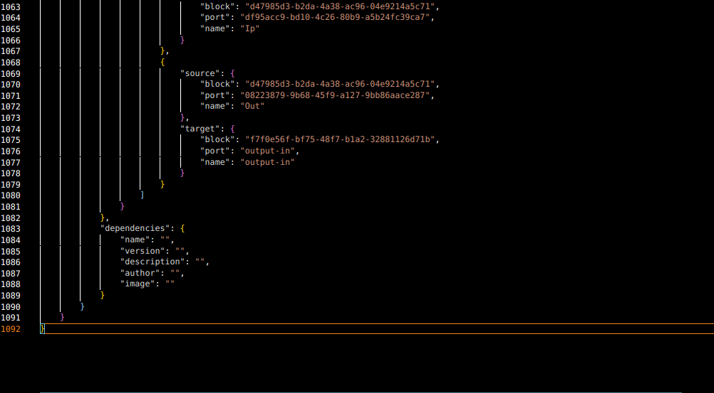

Welcome to the second week of Coding Week progress. In the Monday meeting, we discussed the minimum tasks required for the midterm evaluation, reviewed the previous tasks, and assigned tasks for the next week. One of the issues in VisualCircuit is that it doesn't generate internal scripts for nested blocks. This issue prevents the creation of complex robotics applications. To address this, I will be modifying the block composition this week. Additionally, I created a basic frontend test and installation process within GitHub Actions. This week, I will work on the first global test with GitHub Actions.

## Goals
- [ ] Create first global test workflow [In Progress]
- [ ] Solve the issue of nested block [In Progress]

## Accomplishment and Challenges

* ### Learning tools for Automation - Selenium
To create a global test, I needed a tool that could automatically click respective options in the VisualCircuit application. I explored several technologies such as Puppeteer, Playwright, and Selenium. I chose Selenium as it is widely used for automation. I learned how Selenium works and how to use it.

* ### Integreation of Selenium with Github Action
From my research, I observed that there are two ways to use Selenium with GitHub Actions: one involves the standard installation of Chrome and ChromeDriver, and the other uses the selenium/standalone-chrome Docker image. I chose the second method as it includes the latest Chrome and ChromeDriver, eliminating the need for a separate ChromeDriver. Additionally, it contains all the functionalities of the Chrome browser. Initially, the browser was not displaying correctly on the Selenium Grid, only showing the logo. To view the live action of the process, I opted for noVNC.

* ### Automating clicking File and Open buttons in the Menubar
After successfully running selenium/standalone-chrome on my local machine, I automated the process of clicking the menubar buttons. I needed the XPATH to locate and perform the respective actions. I found the XPATH for the File and Open buttons from the Developer Console. Below is a GIF showing the automation process of opening the browser, launching VC, and clicking the respective buttons.

Automating clicking File and Open buttons in the Menubar:

* ### Research about Block Composition
The first step was to understand the issue created by David Tapiador. I researched the data flow of opening prebuilt VC projects, adding as a block, and the build options. When the project is built, the dependency section includes package and design key-value pairs. The dependencies were not included, which may be the reason for this nested issue.

* ### Adding interdependencies
For nested blocks, I modified the Dependency interface to include the interdependencies element. I also modified the package-model and converter for dependencies. Successfully, interdependencies appeared inside dependencies, but they were blank. This blank state is a great checkpoint as modifying internal structures introduced many errors. I am happy with the progress of this blank interdependencies issue.

Integreation of interdependencies inside dependencies:

## Commits
1. [https://github.com/JdeRobot/VisualCircuit/commit/7ccbea013a311fe1d0af6e71408b84b3b7594f15](https://github.com/JdeRobot/VisualCircuit/commit/7ccbea013a311fe1d0af6e71408b84b3b7594f15)
2. [https://github.com/JdeRobot/VisualCircuit/commit/8ea1c0d35e1ee11f282a7407635ff899c538f34f](https://github.com/JdeRobot/VisualCircuit/commit/8ea1c0d35e1ee11f282a7407635ff899c538f34f)

## Previous PR Updates
1. Merged - [https://github.com/JdeRobot/VisualCircuit/pull/309](https://github.com/JdeRobot/VisualCircuit/pull/309)
