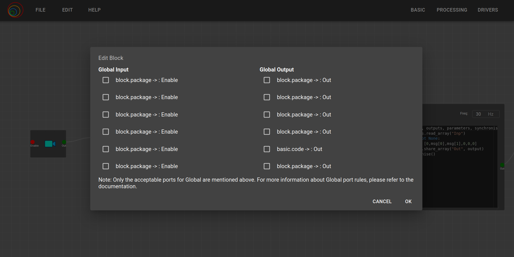
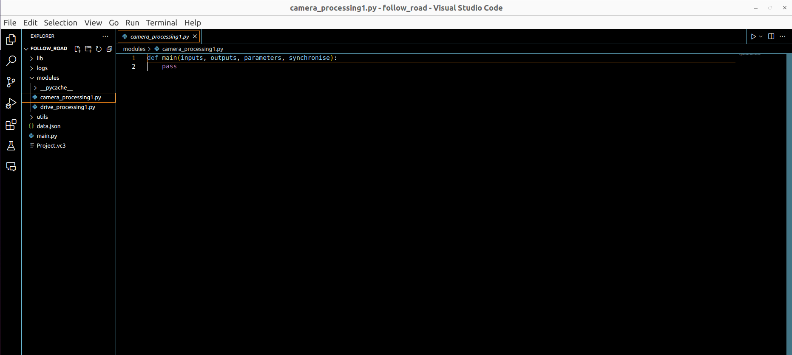

All the issues and possible cases of composed blocks were resolved last week. In the Monday meeting on July 1st, I showed a dummy example of an adder using composed blocks, and the mentors discussed the robotics application that needs to be developed using the composed block feature. In the 6th week, I was busy with personal work and unable to complete my tasks on time, so I requested an extension for the 6th week's work to be done in the 7th week. During the 6th week, I searched for Gazebo worlds and downloaded several open-source ones. My initial plan was to develop the drone gymkhana of RoboticsAcademy using composed blocks. However, it was not available in the newer version of RADI, so I could not obtain the world and models from RoboticsInfrastructure. I decided to go with the Follow Road exercise from RA, as it was already developed but with an earlier version of VC. I also encountered a major issue in composed block that I need to discuss with the mentors.
## Goals
- [ ] Develop the Robotics Application with composed block
* (Major issue found)

## Accomplishment and Challenges
* #### Developed the Follow Road in VC
Before jumping into composed blocks, I developed the Follow Road with predefined blocks.

* #### Solved issues of packages names
There was an issue when there were multiple block packages in block dialog box, making it difficult to identify what to select. This issue was resolved, so now all names of packages are shown in the block dialog box.

Issue image:

After modification image:

* #### Wrong attachment of link issue
In my previous code, I tried to link the block and global ports by finding the name of the ports, but this caused an issue of attaching the link to any block with the same port name. In the new code, it verifies the block ID and name before linking.

* #### Major issue : 
When I used the package block inside the composed block, it didn't generate Python scripts for the internal packages. However, the basic blocks did not have this issue.
Issue image:

