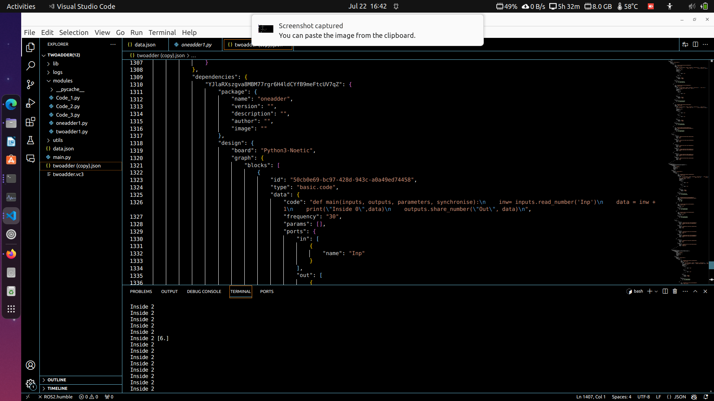

In the eighth week's Monday meeting, we discussed the issues I faced last week and the major issues encountered with the demo application, specifically with the composed block feature. Mentors explained the concept and showed the workflow to address the problem using an encoder and decoder example. The major issue was a nested issue, similar to the hurdles experienced in week 3 regarding nested blocks. This week, I completely focused on the nested issue and achieved significant progress compared to week 3.
## Goals
- [x] Solve the blank dependencies issue - nested issue
- [x] Resolve the issue of nested Python files not appearing in the Modules directories - nested issue

## Images
Nested dependencies in .vc3/ .json file Level 2:

Nested dependencies in .vc3/ .json file Level 3:

Modules directory with all nested python files:

## Accomplishment and Challenges

* #### Analyzing the Week 3 Code for the Nested Issue
Dr. Jose Maria suggested in the meeting to revisit the basics and look for solutions in the internal architecture. Therefore, I recreated the issue from week 3. I wrote two codes: one where a new node is created according to dependencies and new wiring was made. However, this approach was not sustainable due to the potential complexity from multiple dependencies. I dropped that idea. The second approach was recursion-based on frontend side, aimed at getting all dependencies, but it resulted in blank dependencies. After analyzing this solution, I changed the recursion solution from the package level.

* #### Blank dependicies issue
Upon deeper analyzing into PackageBlockModel and factory.tsx, I observed that I had created nested dependencies that were not present in the interface of PackageBlockModel. I modified the dependency array for every script and added internal dependencies to the respective interface and methods. The solution was close to being resolve, but I took a different approach in week 3.

* #### Python script in modules directory issue
Initially, the circuit was not building, but the Save as function was working. Due to nested dependencies, the synthesis file could not be processed. I added a recursive solution to get the nested dependencies from the frontend, which was very challenging. The files were being created but not at all levels. After debugging, I found that the issue was the missing internal dependencies at each level and the improper assignment of keys. The above images attached show the progress made this week.

## PR Created
1. [https://github.com/JdeRobot/VisualCircuit/pull/322](https://github.com/JdeRobot/VisualCircuit/pull/322)

