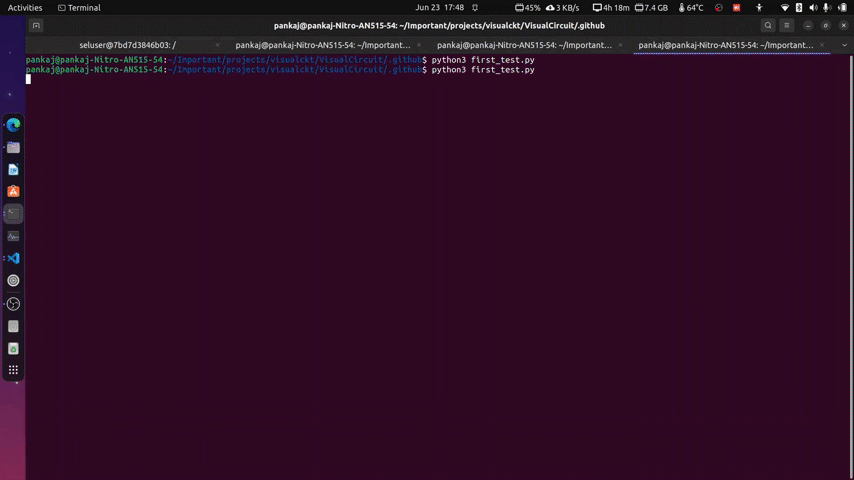
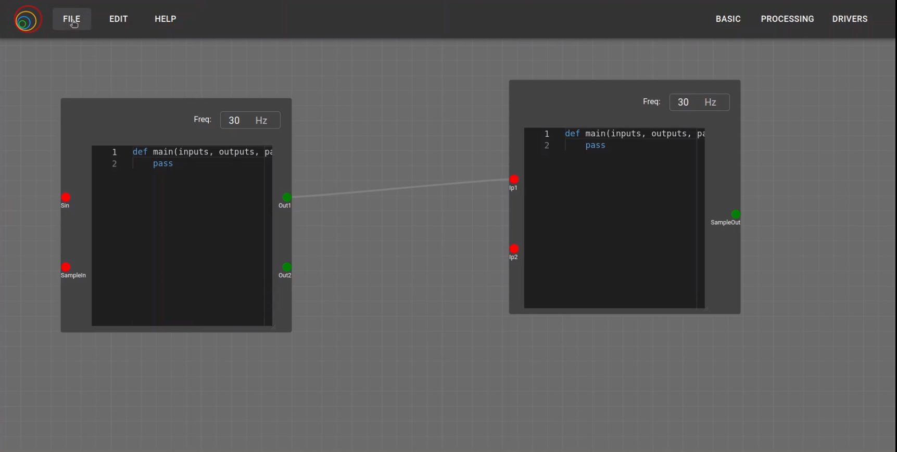
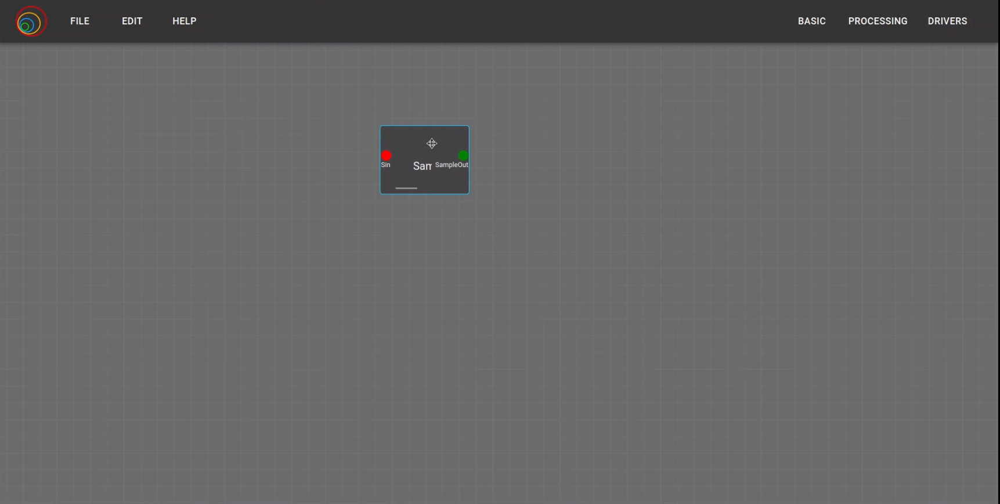
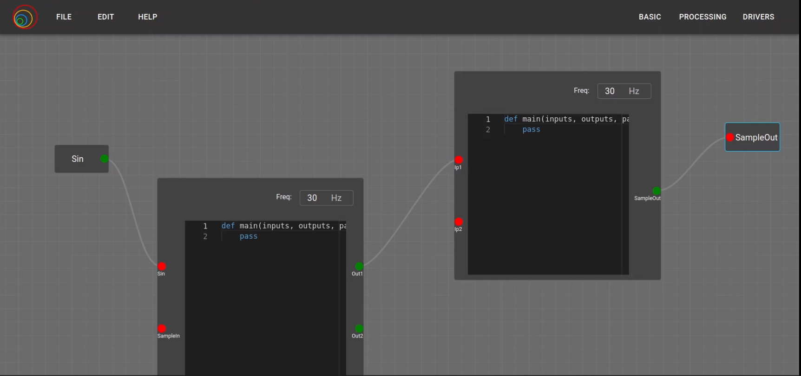

In the fourth week's Monday meeting, I showed a working demo and discussed the previous week's tasks. The mentors suggested working on block composition for global input/output. The other nested issue is quite complex and needs more time, so this task is postponed to other week.
## Goals
- [x] Complete the first Selenium-based global test
- [x] Modification of VC block compostion for Global Input Output

## Accomplishment and Challenges

* ### Pasting .vc3 file and opening the file in VC
I first tried putting the circuit file in the Selenium Docker container through a Python script, but it wasn't a great solution, so I decided to put the circuit file through YAML using Docker commands. After solving this, I needed to open the file from a particular directory in the file manager dialog box. For this, OS-level control was needed, so I used the pyautogui library for opening the file in Visual Circuit.

* ### Building and solving inseure download issue
There were many errors when building the project as the backend was running on localhost on the local machine and had to be accessed from the Docker container, resulting in fetch errors. These were resolved after modifying setting.py and .env. After that, the browser wasn't allowing downloads as Chrome considered the HTTP frontend insecure. After some Googling and searching on StackOverflow, I found a solution. Finally, the whole process was completed automatically by Selenium. The complete process is shown in the GIF below.
Selenium based first automated global test:

* ### Improving fetch Global Input and Output function
In the previous week, I was able to fetch the port data from all blocks, but it was using more iterations and not proper internal functions for fetching the data. So I improved the global input/output function and also added the submit and checklist handlers to pass data to other scripts.

* ### Creating input output blocks automatically from checkbox data
Depending on the port chosen by the user, the particular global input/output block is generated automatically. It checks the port type, and according to that, the input or output block is generated with the same name. Initially, the global input/output block position is the same as the initial position, and the links are null.

* ### Modification of Links and creating respective input output block
I researched the internal structure of the model and tried to access the links and respective link IDs of each block. After this, I wrote down all possible cases for creating a circuit by the user. One case is where the global input/output has zero links, so one link has to be created, and the source and target assigned. Another case is that there is already a link connected with the block, so according to the port type, the particular source or target has to be removed and a new one assigned. Apart from that, there are other cases that need to be tested in the future, such as if there are two links at the same port, which one to choose. I want to ask the mentors about these cases.

* ### Saving and retriving old blocks function
Before generating the .vc3 composed block file, the old model has to be saved so the user can continue working on the circuit without worrying about the blocks global input/output. The model and project info are saved in the stack, and whenever the build is completed, the old model is loaded. There were constant errors, such as storing the data in the stack but it was changing with changes, as I was storing this.activModel directly in the stack, causing changes in the stack. For that, I tried several methods using deepCopy, custom functions, and cloneDeep. Both deepCopy and custom functions didn't work, so I used the cloneDeep library, which worked without any errors. Similar to the "Save as" functionality, I used that part of the code for generating .vc3 file.

Normal circuit to be converted for block:

Global input ouput port selection :

Generated block:

Internal block structure:

## Commits
1. [https://github.com/JdeRobot/VisualCircuit/commit/f9bd5007fa83a4ee2503e1780006a425c1994372](https://github.com/JdeRobot/VisualCircuit/commit/f9bd5007fa83a4ee2503e1780006a425c1994372)
2. [https://github.com/JdeRobot/VisualCircuit/commit/51c82737938e5370e1e3047b5ee9d9bdeb117940](https://github.com/JdeRobot/VisualCircuit/commit/51c82737938e5370e1e3047b5ee9d9bdeb117940)
3. [https://github.com/JdeRobot/VisualCircuit/commit/0d3759b154f110318e6b6b7e29fa61012262238a](https://github.com/JdeRobot/VisualCircuit/commit/0d3759b154f110318e6b6b7e29fa61012262238a)

