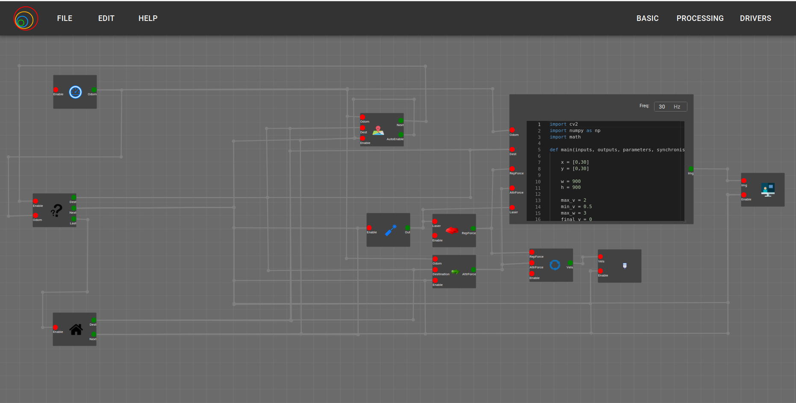
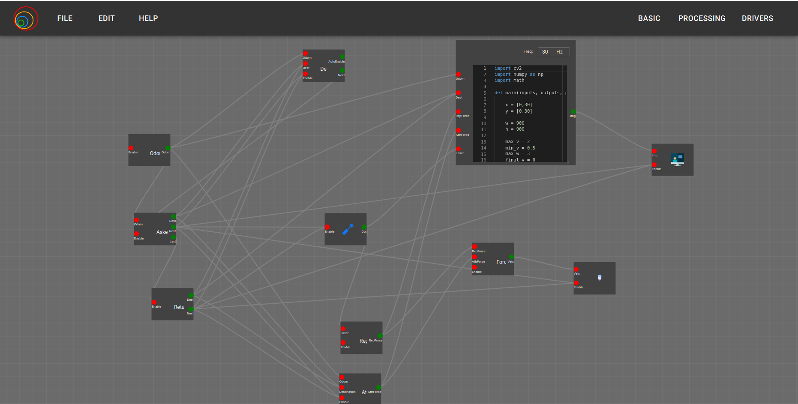
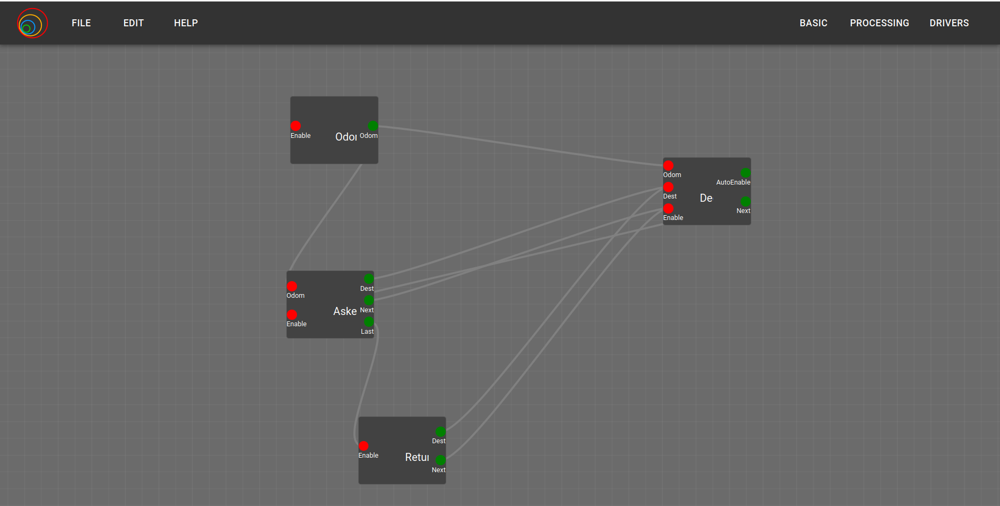
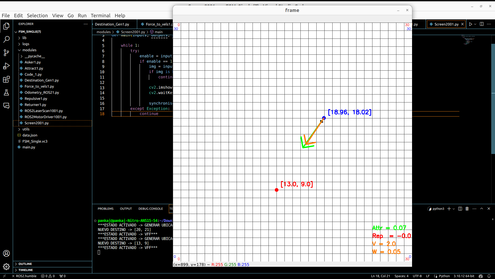
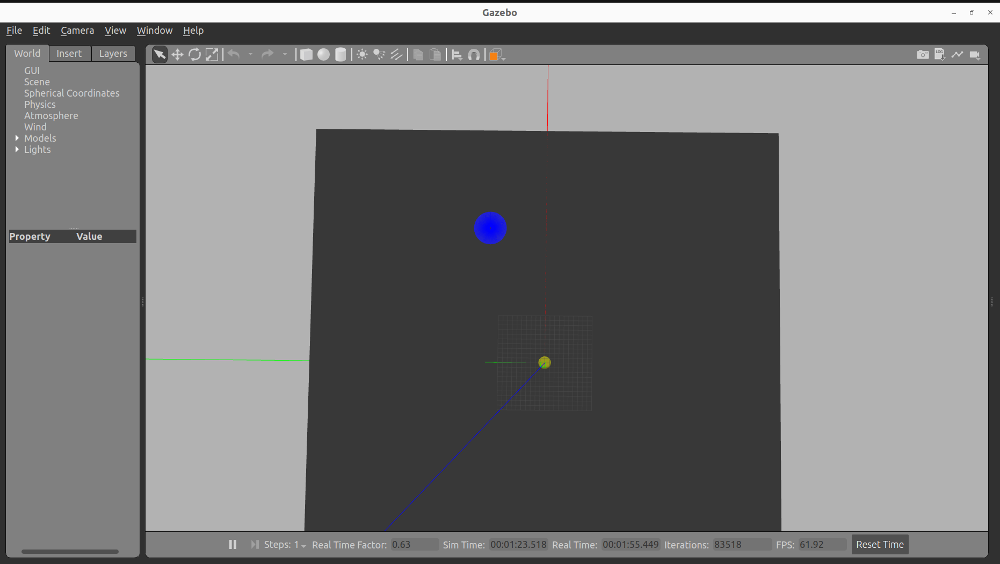
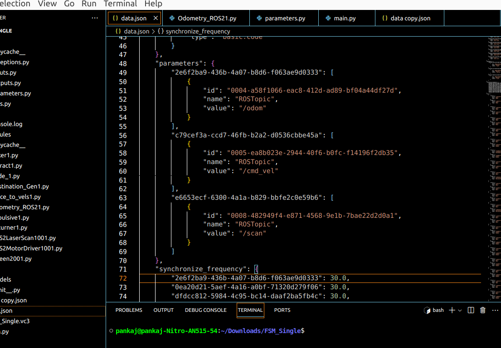
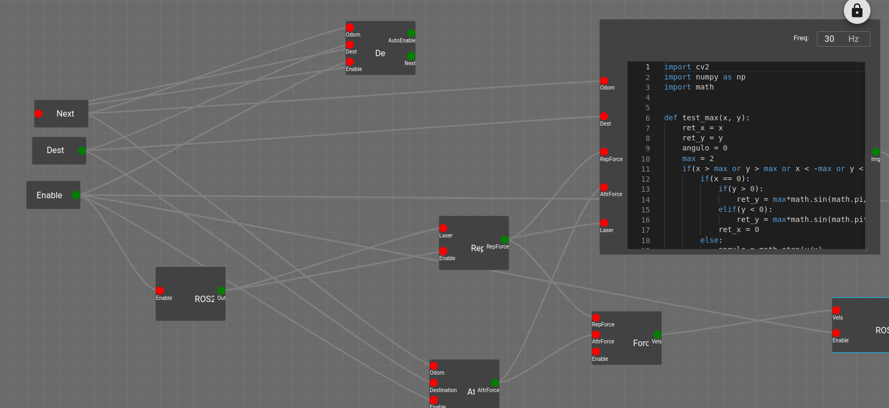

In the tenth week's Monday meeting, we discussed progress until the ninth week and outlined the tasks for the upcoming week. The main goal is to perform a robotics application with new nested code. I chose David's FSM issue for the robotics application. Mentor Dr. José María sent the GitHub link to David's repository. Several issues arose, and one is still ongoing, which I will discuss in the Challenges section. Through this robotics application, several loose ends were identified, and I resolved them this week. However, one issue remains that I need to address.

## Goals
- [ ] Solve the Robotics Application with nested and composed version (Found Issues)

## Sub-Goals
- [x]  Understand David's FSM circuit and issue
- [x]  Replicate David's VC Circuit with a newer version
- [x]  Run the FSM on a single level
- [x]  New issue: Nested parameters not appearing in the build file
- [x]  Resolve the parameters issue by modifying earlier version code
- [x]  New issue: Analyze the issue of nested FSM; unable to run single port with multiple IN and OUT.
- [x]  Update the blog page with about, home, sidebar.

## Images
Older version FSM single level circuit:

Recreated working FSM circuit with nested code:

Output of single level:

Parameter issue:

Single port - Multiple IN and Multiple OUT issue:

## Accomplishment and Challenges

* #### Replicating David's FSM Circuit
The nested issue was opened by David around a year ago when he faced this problem while creating the FSM circuit with VC. My first goal was to recreate the nested FSM circuit. You may wonder why recreate it? The circuit was made with an earlier version, and the internal blocks will not have interdependency if I build with the older .vc3. So, I had to recreate every block and circuit. There was an issue when I ran the parameters; they were missing, so I checked with data.json and found missing parameters.

* #### Parameter Issue in Nested Code
The earlier code was developed for one code block dependency, similar to nested blocks. The parameter IDs depended on the "type ID" of the dependency, but if multiple blocks are inside the dependency, this method will have the same type ID, and the parameters cannot map to the correct block. This type_ID needed to be changed in nested code. All blocks in data.json are at a single level, so the types are basic blocks. Initially, I thought to create a random alphanumeric string of 30 characters as the parameter ID. After implementing it, many issues were found, such as if parameters are used in input and output, leading to more confusion in wire mapping. Then, I implemented a new ID not dependent on type_ID, and particular wires will map with blocks, so the issue of mapping extra wires also won't occur.

* #### Single level FSM Circuit
After solving the parameters issue, I proceeded with the single-level FSM circuit. The blocks such as laser_ROS2, motor_ROS2, and screen used by David were not from the block library. Initially, it didn't work, and finding the issue took more time. After analyzing the internal code of the above blocks, they were customized. After modifying and recreating, the whole logic ran without any issue. I ran turtlebot3 in an empty world inside my local machine and ran the FSM logic with VC.

* #### Issue in multi level FSM Circuit (Major issue)
After running the single level, I was confident it would run with nested, but as the saying goes, things don't always go as planned. David used single port multiple OUT to different blocks and took input outside of the composed block from multiple blocks. However, I wrote for single IN - OUT, so it could not map the multiple blocks; it was taking one block and connecting to another block. This is a big issue as it requires looking again at the mapping of wires and adding conditions for such situations.

## PRs Created
1. Open - [https://github.com/JdeRobot/VisualCircuit/pull/325](https://github.com/JdeRobot/VisualCircuit/pull/325)

## Issues
1. Open - [https://github.com/JdeRobot/VisualCircuit/issues/324](https://github.com/JdeRobot/VisualCircuit/issues/324)

## Links
1. Midterm update linkedin post - [https://www.linkedin.com/feed/update/urn:li:activity:7226124206420180992/](https://www.linkedin.com/feed/update/urn:li:activity:7226124206420180992/)

