## Project Overview
This GSoC project focuses on adding a global block composition feature, resolving nested issues, modifying the current version's single dependency codebase to a multi-level dependency, implementing two or more demo robotics applications, expanding the block library, automating the testing of VisualCircuit and its documentation using GitHub Actions, and releasing the new version with all issue fixes. 

The last 16 weeks have been an incredible and exhilarating journey filled with learning, challenges, and accomplishments. It was a great experience to work on such an exciting project, applying my web development skills to the field of Robotics, a domain I’m deeply passionate about, and learning more about both areas along the way. These past few months were exciting and memorable, with late nights, early mornings, and sometimes not sleeping at all. The joy of completing tasks is hard to describe in words (though my weekly blog attempts to capture some of that emotion).

This entire journey wouldn't have been possible without the guidance and support of my mentors, Dr. José María Cañas and Toshan Luktuke, whose expertise and dedication were crucial every step of the way.

Thank you to Google for organizing GSoC, and to everyone who has been a part of this journey!

This blog post will be a quick summary of what I worked on during the GSOC period.

### Mentors
 - [Dr. José María Cañas](https://github.com/jmplaza)
 - [Toshan Luktuke](https://github.com/toshan-luktuke)

**Official Repository:** [VisualCircuit](https://github.com/JdeRobot/VisualCircuit/)  
**Github Issues**: [Summary](https://github.com/JdeRobot/VisualCircuit/issues?q=author%3ABkPankaj+)  
**Pull Requests:** [Summary](https://github.com/JdeRobot/VisualCircuit/pulls?q=author%3ABkPankaj+)  

## Goals
- [x]  Developed a CI pipeline using GitHub Actions, including tests for frontend rendering and building a package with the complete architecture.
- [x]  Introduced a composed block feature to simplify block development. 
- [x]  Modified the current version to support multi-level multi-block dependencies. 
- [x]  Created an autoparking demo with ROS2 and VisualCircuit during the community bonding period.
- [x]  Resolved the nested block issue, enabling support for creating multi-level blocks.
- [x]  Fixed the parameter issue for multi-level blocks.
- [x]  Solving the line follower exercise of Robotics Application with composed feature.
- [x]  Recreated FSM Circuit and follow person with both single level and nested level.
- [x]  Developed several new blocks, including Generic PID, Person Detector, and Laser ROS1.
- [x]  Addressed the issue of identical IDs being assigned to multiple instances.
- [x]  Fixed the issue where model data remained unchanged when the Back button was pressed.
- [x]  Resolved the single port with multiple input/output issue when the number of inputs and outputs is the same

## Demo
* [Composed and Nested Blocks Feature Demo - v3.6](https://www.youtube.com/watch?v=xvceQL8AgQ4)

<iframe width="560" height="315" src="https://www.youtube.com/embed/xvceQL8AgQ4?si=MC2oF-uPD1HaN6A9" title="YouTube video player" frameborder="0" allow="accelerometer; autoplay; clipboard-write; encrypted-media; gyroscope; picture-in-picture; web-share" referrerpolicy="strict-origin-when-cross-origin" allowfullscreen></iframe>

## Community Bonding
The first GSoC meeting with mentors took place on May 6th. This meeting focused on introducing the community and mentors, as well as outlining the tasks for the early weeks of the community bonding period.

### Key tasks
  - Creating a blog website
  - Setting up RoboticsAcademy
  - Understanding the Robotics Application Manager architecture
  - Developing the Laser ROS1 block, solving the autoparking exercise with ROS2 and VisualCircuit
  - Publishing a video on JdeRobot’s YouTube channel
  - Learning about GitHub releases

  There was also a meeting with the entire community and GSoC 2024 contributors during the second week of the community bonding period, which provided greater insight into other projects. Additionally, the mentors explained the project goals, including block composition and the nested issue. Although I was initially unclear about this, the explanation made it evident that the issue was crucial, as it impedes users from creating complex applications.

* [Autoparking exercise with VC and ROS2 demo](https://youtu.be/SRSmFSIsZWQ?si=qu_DoqOhfxu3OkGi)

<iframe width="560" height="315" src="https://www.youtube.com/embed/SRSmFSIsZWQ?si=UBp4ZiqGCI-VoG_Z" title="YouTube video player" frameborder="0" allow="accelerometer; autoplay; clipboard-write; encrypted-media; gyroscope; picture-in-picture; web-share" referrerpolicy="strict-origin-when-cross-origin" allowfullscreen></iframe>

## Coding period
I initially started with basic tests using GitHub Actions. In the first step of the basic test, I wrote code to install dependencies for both the frontend and backend. I learned GitHub Actions and YAML by observing the CI workflows of other repositories. The CI workflow is triggered whenever there is a pull request to the master branch. After writing the setup code for the CI workflow, I completed a basic frontend test. I encountered a "MODULE NOT FOUND" frontend error because I had stored the node_modules in artifacts. Storing node_modules in artifacts is not ideal since artifacts are typically used for build files. I also modified the blocks in the VisualCircuit resources repository.

CI Workflow tested in forked repo:
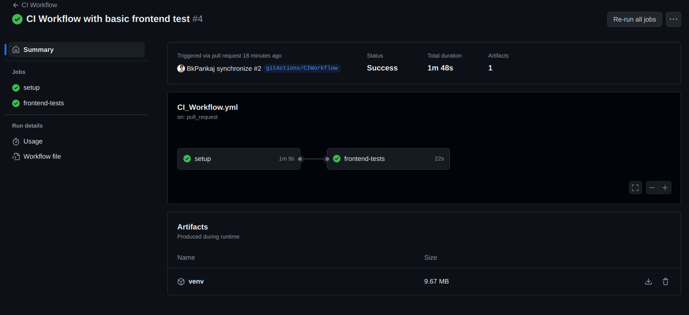

After completing the basic frontend test, I proceeded to the Selenium global test. To prepare, I learned Selenium through documentation and YouTube videos. I chose Selenium because I wanted to check the overall functionality of the VisualCircuit application, which involves importing the .vc3 file and building it. This requires GUI interaction, for which Selenium is well-suited. I used Selenium Chrome Standalone for this purpose. Initially, it took some time to understand Selenium Grid and how to open live sessions. By looking at examples from Google, I learned how to click specific buttons by accessing their HTML elements. The File and Open buttons were clicked through Selenium. I also started working on frontend-side interdependencies. This progress occurred during the initial two weeks of the coding period.

Everything was going according to the timeline. Next, it was time to explore block composition and nested issues. I began by adding the Global Input/Output dialog box. I used two approaches to solve the nested issue, but both were disappointing as blank inter-nested dependencies were still appearing in the .vc3. I completed the remaining part of the global test by uploading the .vc3 file into the Selenium Grid, opening it, and building the file. To upload the .vc3, I tried different approaches such as uploading it through YAML, using Docker commands, and leveraging various Python libraries. Ultimately, pyautogui worked for interacting with the OS within Docker. I also improved the Global Input and Output function for fetching the ports for global input/output. Additionally, I modified the code for dependencies on the frontend side but still encountered the same blank issue.

Selenium based first automated global test:

### Global Input Output
  At the end of week four, I had touched on all the tasks I needed to do during the coding period. The progress in automated testing was great as Selenium and frontend tests are good for testing the whole architecture of VisualCircuit. Also, the global input/output dialog box was in great shape. However, the nested dependencies still had issues, and the solution seemed more complex, so my mentors and I decided to leave this task for now and continue it in the coming weeks. Let's start the story of block composition. I took it into my hands when Dr. Jose Maria explained the details and issues regarding block composition during the second week of the coding period meeting. The main goal is to improve efficiency and make VisualCircuit easy to use, generating and using composed blocks without any time delay. As I stated earlier, my first approach was to create a user interface for selecting the input/output that needed to be exposed to external blocks. After that, there will be processing for generating the .vc3 as per the user without disturbing the current circuit on the screen. The issues and challenges were discussed in weekly blogs, so please refer to that for more details.

- #### Block Dialog Box and fetching ports
  I referenced the "Edit Information" option as I needed a somewhat similar dialog box. So I replicated that, and now the blank dialog box was ready; it was time to fetch all the details, put them in, and let the user select them. For fetching ports, I created a function in editor.tsx that iterates over all blocks in the model and extracts the port names and types with IDs. After fetching the data, it was time to put all the fetched data in the dialog box with checkboxes, but before that, VisualCircuit has some cases to consider to ensure proper user access.

  Global ports selection dialog box:
  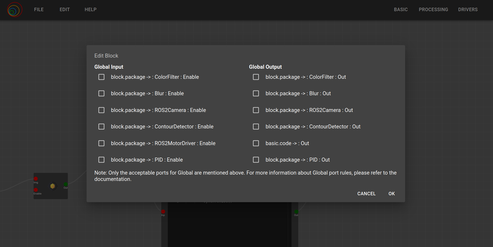

- ##### Possible cases
    - The global input port should not link to the block's port whose link is present with another block. This protects against double data issues on the block side.
    - The global output port can be attached to the block's port in any case, whether there is a wire present or not. The aim is to allow the global output port to be used for debugging.
    - No internal wires should be removed if global input/output is used in between the circuit.

- ##### Processing
  Once the user selects the respective port and clicks OK, the processing begins. First, all selected ports are fetched and processed in a specific order so that one variable can be used to fetch data. After this, processData is used to create new links for input and output. A new global input/output block is generated, and the block's position and node are added with canvas repainting. After this, the new link and block type are checked, and the blocks are linked as source and target accordingly. This process is repeated for each global input/output until all are processed. Then, the .vc3 file is generated with all the changes. Before processing, the model was saved in a stack so it could be retrieved after completion, and the whole canvas is repainted with all models kept the same. This way, the current circuit is not disturbed. This process reduces the time for building the circuit; previously, all linking blocks and creating were manual with disturbance in the circuit. So, in one way, the whole process is automated without disturbing the current work.

### Composed Block and nested issue
The global input/output feature was unable to generate internal nested dependencies, leading to a significant issue. I discovered this around week 7 when I created a line follower demo with composed blocks. Let's delve deeper into the composed block and nested issue. I continued working on the same approach from week 3, but it resulted in the same blank dependencies. I then had a meeting with my mentors to discuss how to proceed with this issue. Dr. Jose Maria gave an example of an encoder and decoder that relates frontend and backend processing. So I started with the basics from scratch.

- ##### Blank dependencies in .vc3
The blank dependencies in the design section were due to the frontend encoding, confirming that there was no issue with synthesis.py. I then revisited my previous solution and included proper recursion for obtaining all nested dependencies. The solution is quite similar to the graph DFS algorithm, but this was my first time implementing it in a real-life application. However, there was still an issue after this modification. I found that the interfaces for Block and Dependency were not properly defined, which led to the blank object. So, I modified converter.ts and interface.ts. Yes! It worked! The issue was very small but quite complex. The recursion method now goes into every block and its dependencies, which was missing in the week 3 approach.

Nested dependencies in .vc3 .json file Level 2:
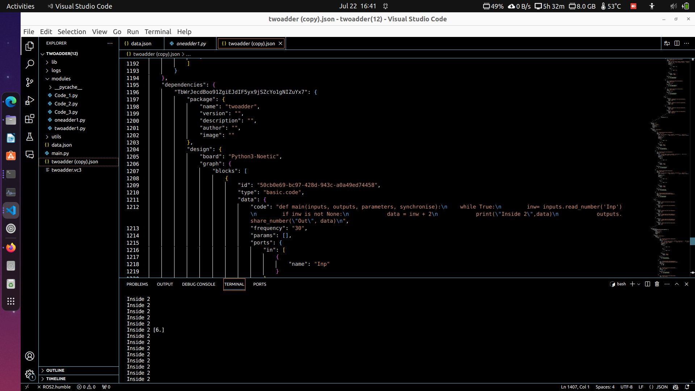

- ##### Python Scripts in modules directory issue
After resolving the blank dependencies, the next issue was the absence of Python scripts in the modules directory. This required modification on the backend side. Specifically, in synthesis.py, all nested blocks should be iterated to generate the Python files. The process involves iterating through design, dependencies, and again design dependencies, ensuring that no block is left out.

Modules directory with all nested python files:
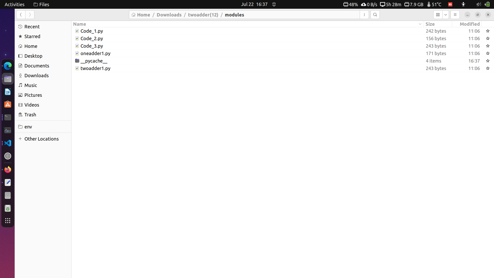

- ##### Blocks and wires missing in data.json issue
The above iteration is sufficient for creating JSON block objects as it iterates over each one. Wires are also appended similarly to block iteration. But there was a catch... blocks were not linking properly to wires as the path between (block - global input/output - block) is present in the composed circuit, whereas the data.json contained details of blocks, not the global part, and that wire should be mapped directly. Additionally, if there are two or more levels, then two or more global wires must be mapped properly. The error was primarily due to Input or Output not being present, as main.py takes all wire links for data transfers since they run in each block as one process. So, the process would get stuck at those errors, requiring proper mapping.

Before modification of nested issue - data.json:
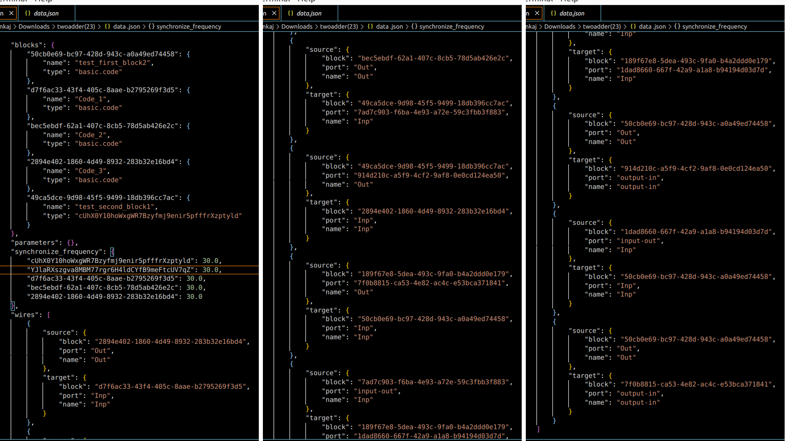

- ##### Filtering and mapping
Not only wires but blocks need to be filtered, as there can be other block types—only code blocks should be appended. Additionally, the dependency blocks should not be appended; only the internal code needs to be appended. All these modifications were made on the block side by adding a condition for the block type in the previous iteration.

After modification of nested issue - data.json:
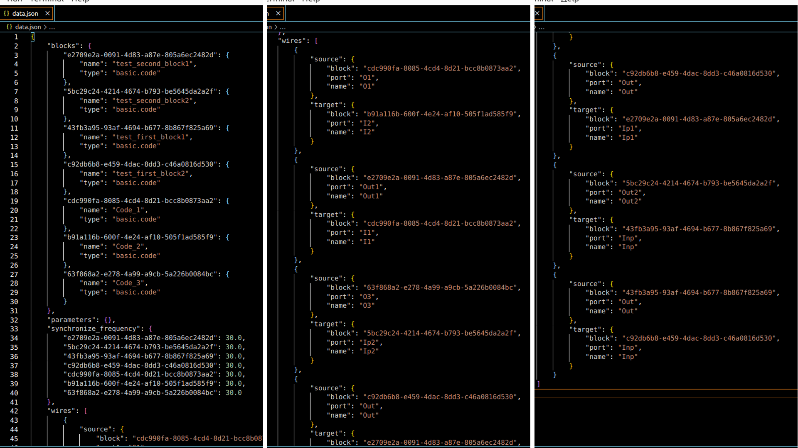

The main issue now was filtering and mapping the wires, which required more recursive iteration. I performed the iteration until no global-type package block wires remained. In the first iteration, I stored the opposite of the global wire to be retained while making the particular global wire's source/target absent. In the second iteration, I looked for the same type of ID with the previous global ID and replaced the opposite source/target. If the opposite of the global wire was initially global, it was not deleted; otherwise, it was removed. These iterations continued until the above condition was met. This is a brief logic; you can visit the weekly blog for more details.

- ##### Modification from Single Block Dependency to Multi-Level Multi-Code Dependency
After mapping, the next issue that arose was handling multiple code blocks within dependencies, as the existing blocks weren't able to map correctly. This problem stemmed from the current version being designed for single block dependency. To resolve this, I converted the composition so that higher-level blocks were not stored in data.json. Instead, I transformed the higher-level blocks into a single level before appending them to data.json. There were many errors related to IDs because, in the initial version, the dependency ID was attached to every block, making it impossible to retrieve all blocks of a dependency. I modified this by using the ID of the basic-level block and mapping only those.

- ##### Parameter issue
During this time, another two weeks had passed, and the nested issue was still in the solving phase. The problem occurred when dependency internal blocks contained parameters, as the parameter ID was linked to the dependency type ID. This was removed in the new modification. Adding the parameters is important because many blocks, such as ROSTopic, Kp, Ki, etc., use parameters. So, new IDs were assigned to the parameters and linked through the source-target method. Before settling on this approach, I initially tried assigning types to avoid changing the parameter ID, but that approach was not feasible for more than two parameters within a dependency.

Parameter issue:

#### Issue of identical IDs across multiple instances of the same block
This issue was unexpected but occurred when using two identical blocks. It became apparent that users might want to use two or more identical blocks at any level of a circuit. The problem was encountered when using two PID blocks for the line follower demo. In data.json, only one PID block was being recorded because basic.code had the same ID, causing it to replace the previous block's value. To fix this, I modified the IDs of blocks randomly during the loadPackage function and mapped them in the wires accordingly. It took one iteration to modify the block IDs and another to change the respective wire IDs to match the newly assigned block IDs. This approach worked, but when I tried to modify the value inside a package block, the same issue resurfaced. The problem was that the editor layer stored in the stack by the Back function was not modified in the previous iteration, so I added an extra iteration for the layers. Booyah! It worked.

#### Other Issues
Apart from these major issues, several other challenges arose, which I explained in more detail in my weekly blog. The above explanations provide a high-level overview, but for in-depth details, please refer to the weekly blog.

#### New Blocks and Demos
I developed the Laser ROS1 block during the community bonding period, along with the Generic PID Block and the Person Detector block, which takes an input image and outputs the image with detected boxes, including objects and probability, person detection, and xy, wh values. Additionally, I worked on the Auto-parking with ROS2 and VisualCircuit during the community bonding period. During the coding period, I recreated the line follower, FSM circuit with composed, and single-level circuit.

Composed circuit of line follower:
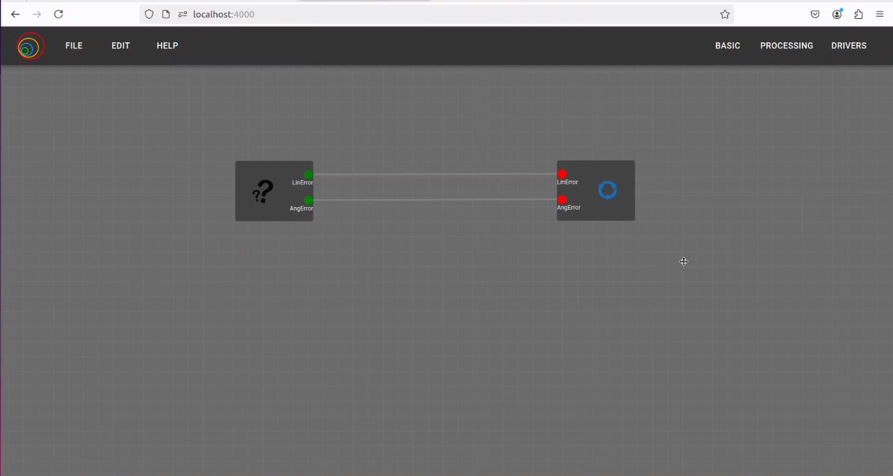

Internal perception composed block:
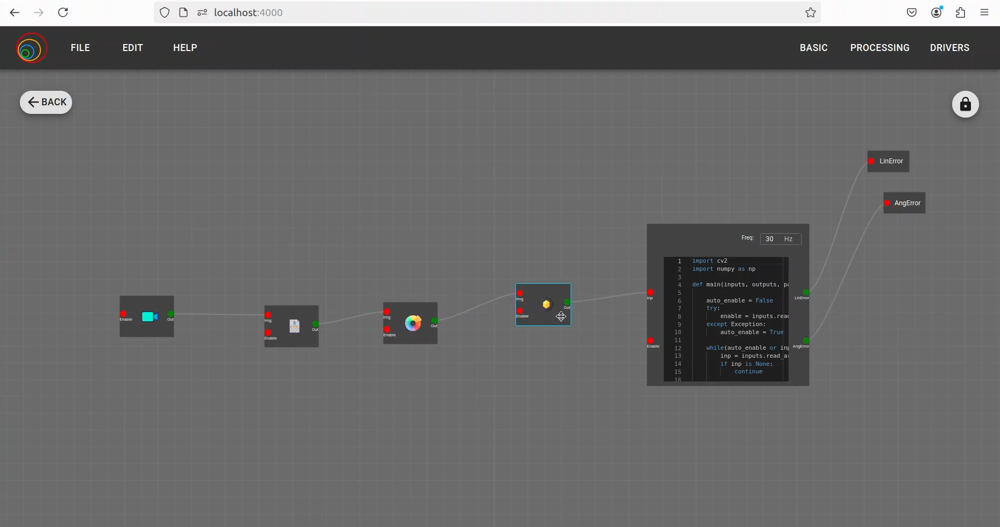

### After GSoC
I see this as just the beginning of my contributions to JdeRobot, and I look forward to contributing not only to VisualCircuit but also to other projects. There are several areas I have observed that I would like to work on, including:

- Addressing loose ends from the GSoC work, such as resolving the multiple block single port issue in the composed block feature and other related issues.
- Making the CI workflow more robust and solving the Selenium URL issue in GitHub Actions.
- Improving and integrating Dockerization of the Robotics Backend in VisualCircuit.
- Exploring the management of multiple hardware blocks, such as cameras, within a single circuit (e.g., one in a composed block and another at a higher level), and developing strategies for this.
- Developing more real-life robotics applications with VisualCircuit.

### Extra Images

First meeting with mentors screenshot: 
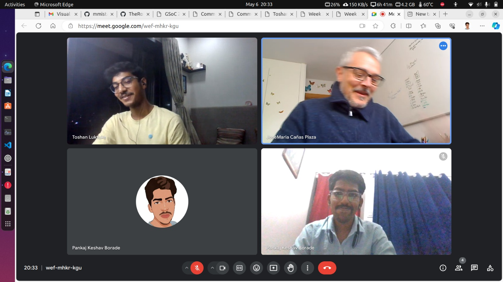

First meeting with JdeRobot community screenshot: 
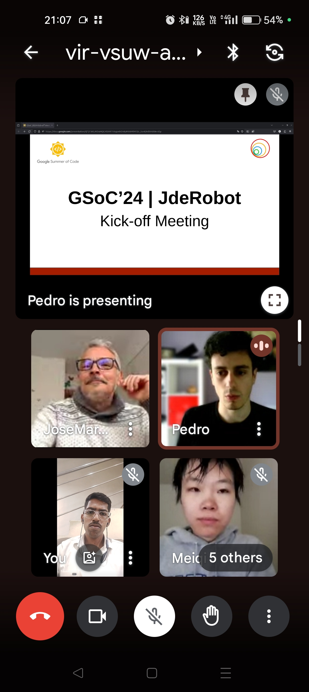

Week 5 meeting screenshot: 
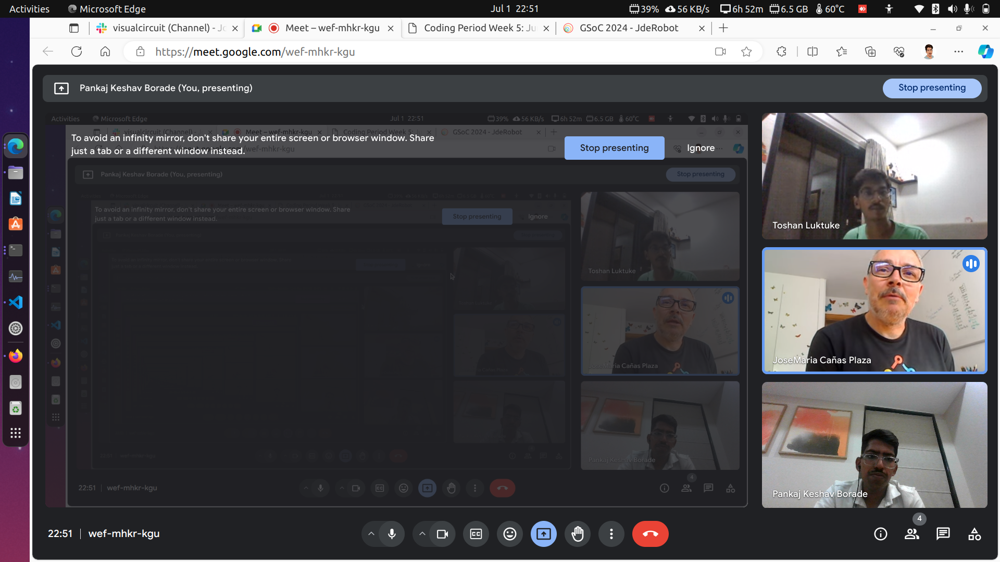

Week 12 meeting screenshot: 
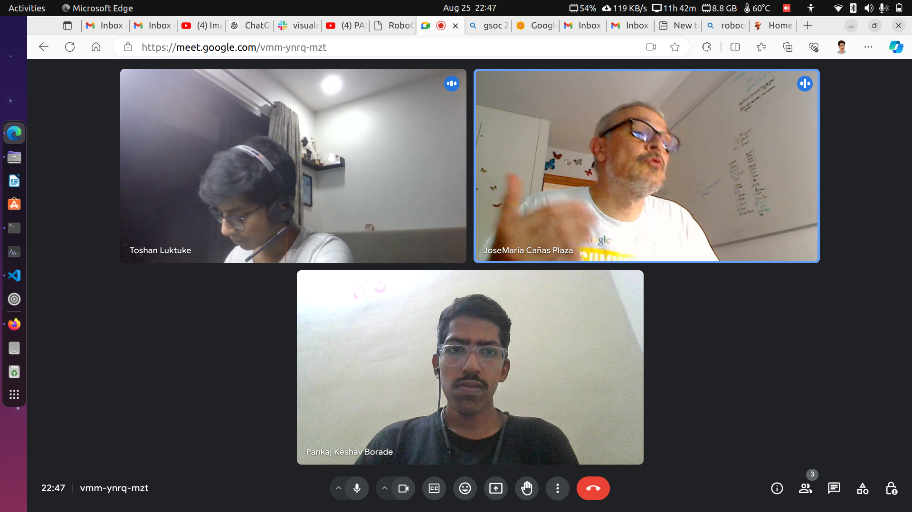

Person Detector Block testing: 
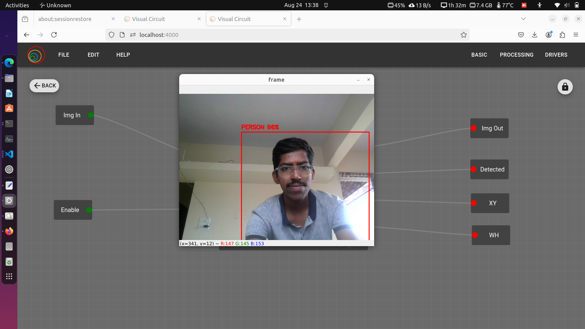

