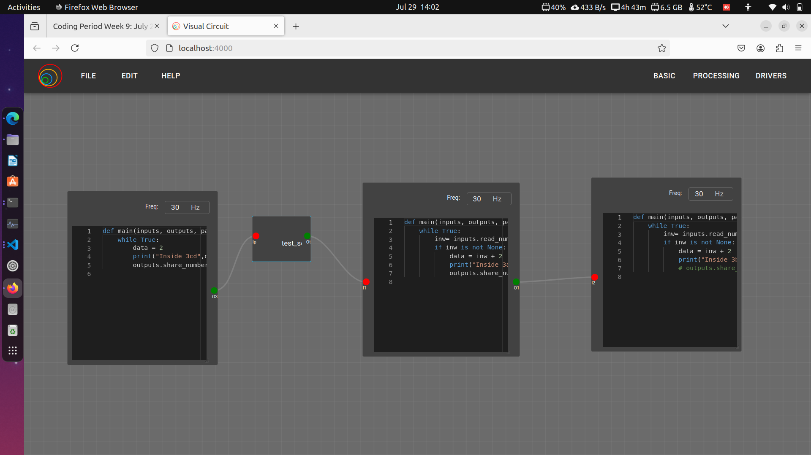
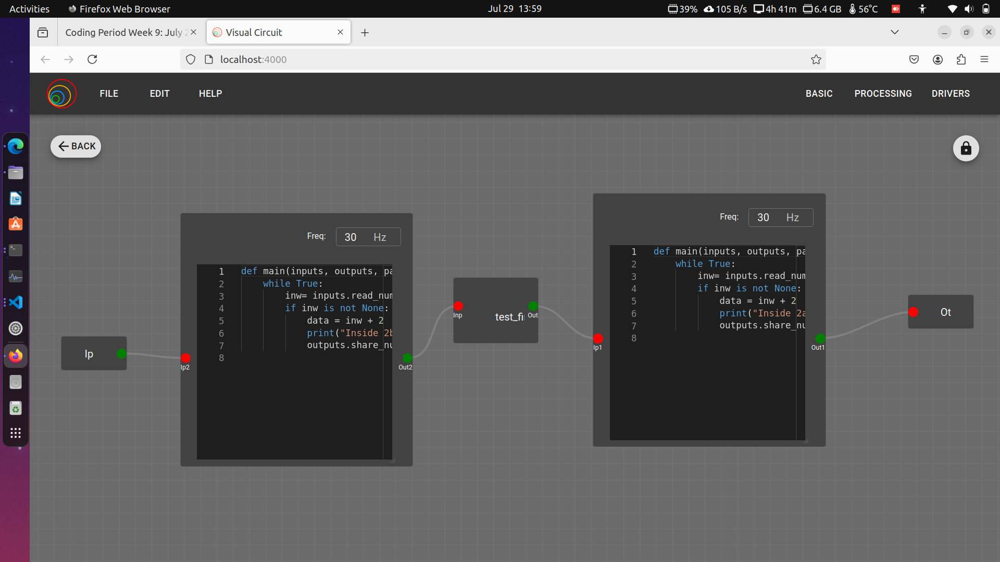
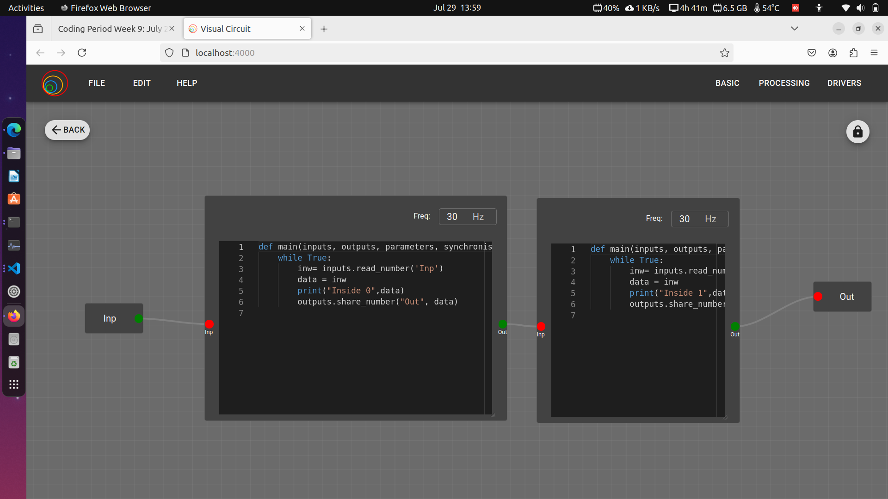
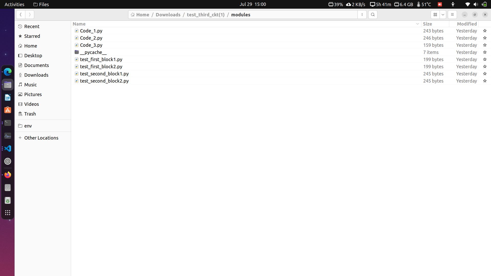
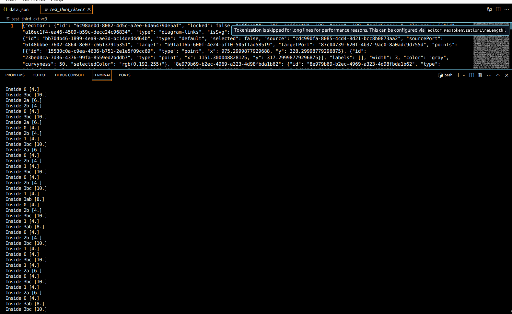

During our Monday meeting, we discussed the progress I made on the nested and composed block issue and outlined what needs to be achieved in the upcoming weeks. Essentially, there were two main goals for this week, but the nested issue had many internal problems. In the current version, dependencies could only have a single code block, and wires and blocks were created for whole dependencies. If there were multiple codes, it would only take one code block and generate the data.json. Therefore, I also needed to fix this and make all links and blocks from multiple levels into a single layer in the backend processing. This is why resolving the nested issue took more time. Additionally, there were many errors that came up during the process, which further delayed progress. However, by the end of the week, the entire nested issue was resolved.

## Goals
- [x] Solve the nested issue completely
- [ ] Integrate nested code into last week composed block code.

## Sub-Goals
- [x] Understanding backend processing for single-level dependencies.
- [x] Creating sample tests to determine necessary wires and blocks for the built zip file.
- [x] Fixing the issue of missing nested wires in data.json after backend processing.
- [x] Addressing the problem of missing nested internal blocks in data.json.
- [x] Modifying the current version's single code block dependency code to support multi-level dependencies with multiple code blocks.
- [x] Writing code for processing wires, including filtering and mapping to required blocks.
- [x] Removing unwanted links between global inputs outputs and testing the nested issue code with different examples.

## Images
Level1 Sample Circuit:

Level2 Inside test_second_block Block (nested level 1):

Level3 Inside test_first_block Block (nested level 2):

Before modification of nested issue - data.json:

After modification of nested issue - data.json:

Python Modules Scripts after processing:

Output including printing at every level and code block:

## Accomplishment and Challenges

* ### Modifying the Current Version to Support Multi Code Block Dependency

When I completed writing the entire logic, I found that multiple codes were not supported, and extra wires were created that couldn't connect. Additionally, other code blocks of inter-dependency were not included in data.json, leading to improper linkage. I modified synthesize_modules and changed the logic for adding internal blocks, so they were not treated as whole dependencies. This way, the blocks were added at one level.

* ### Understanding Backend Processing by Creating Sample Tests
To understand the process, I created a sample test and added blocks and wires in data.json. This helped me see how the internal file structure of the zip file works after building. I drew the whole connection and tried to replicate it by modifying synthesis.py using recursive and iterative techniques until level 1 was achieved.

* ### Fixing the Issue of Missing Nested Blocks After Backend Processing
I created the process_dependency function, which is called inside synthesize_modules. This function iterates over all blocks of a dependency and creates module Python scripts depending on the block type. Only code block type modules and block values are included in data.json. If there is a dependency inside a dependency, process_dependency is called recursively until no nested dependencies are left. This method ensures that only code blocks are included in the modules directory, while other blocks such as global input/output, dependencies, and constants are filtered out.

* ### Writing code for filtering and mapping the wires in backend
After obtaining the proper blocks in data.json, I focused on the wires. In the current version, level 1 blocks were being added to data.json, so I modified process_dependency to include every wire. There were wires for packages and global input/output, which required proper filtering and the creation of new links between the required blocks. I iterated over all wires selected from process_dependency and segregated them based on the wire's source and target block ID. After that, in another iteration, I checked each wire with the filtered blocks in data.json to determine if the block was present, adding the key pair of ob:absent. Then, I created process_wire, where all wire mappings were handled. This function contains nested iterations:

1. The first internal iteration iterates over all valid wires, checks for global input and output, and either saves the wire in a dictionary or removes the entire source-target link based on the presence of the absent value.
2. The second internal iteration checks the wire's port, replacing package-type wire with the corresponding source-target dictionary generated in the last iteration.

This way, new links are created, and the absent value helps the code decide whether to loop again or exit process_wire.

## PRs Created
1. Closed and Merged - [https://github.com/JdeRobot/VisualCircuit/pull/322](https://github.com/JdeRobot/VisualCircuit/pull/322)
1. Closed and Merged - [https://github.com/JdeRobot/VisualCircuit/pull/323](https://github.com/JdeRobot/VisualCircuit/pull/323)

## Commits
1. [https://github.com/JdeRobot/VisualCircuit/commit/a367ffb4f22dd3b2396633ef6e909108777e0376](https://github.com/JdeRobot/VisualCircuit/commit/a367ffb4f22dd3b2396633ef6e909108777e0376)
1. [https://github.com/JdeRobot/VisualCircuit/commit/3afffd77ab40766c36ebbbcb1bb603feb38b70eb](https://github.com/JdeRobot/VisualCircuit/commit/3afffd77ab40766c36ebbbcb1bb603feb38b70eb)
1. [https://github.com/JdeRobot/VisualCircuit/commit/91ae5f1a8b4abe80ce3c2edf128467f6376f4644](https://github.com/JdeRobot/VisualCircuit/commit/91ae5f1a8b4abe80ce3c2edf128467f6376f4644)

