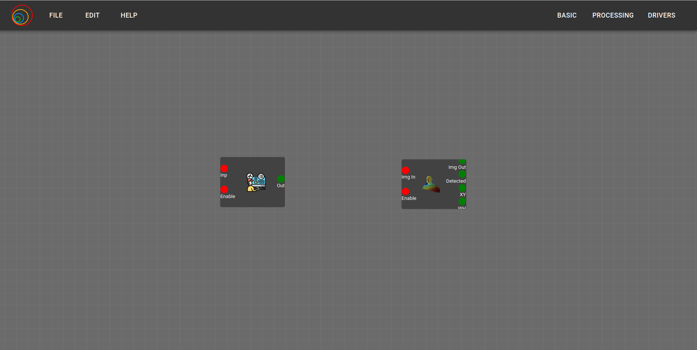
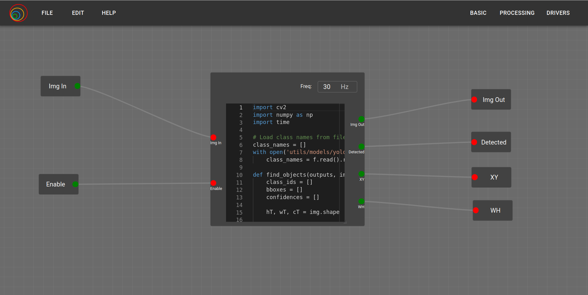

This is the final evaluation week, where ongoing and new errors were resolved, a demo video was created, and the summary report for the final evaluation of GSoC was written. New blocks, such as a generic PID and person detector, were also developed and tested by creating demo circuits. Although there are some loose ends left that I plan to address after GSoC, everything in the current version works perfectly. The remaining loose ends are additional features that need to be added.

## Goals
- [x] Develop generic PID and person detector blocks
- [x] Test new blocks by creating demo circuits
- [x] Refine the code and add comments
- [ ] Resolve the issue with multiple instances of prebuilt package blocks
- [x] Create and edit demo video for final evaluation
- [x] Complete summary report and publish the video on youtube

## Accomplishment and Challenges

* ### Generic PID and person detector block
  Now it's time to add some blocks. First on the list is the Generic PID. A question that might arise is why we need this if there is already a PID block. Like you, I asked this question to my mentors, and they explained that the current PID block is designed for a particular use case where the PID is applied to angular velocity, while linear velocity remains constant. This PID block cannot be used for every case, which is why a generic PID block is needed that takes the error and provides a resulting value for both linear and angular velocity, not just angular. The generic PID can be used in any application.

  For the person detector block, I took reference from the Object Detector block. According to my mentor, we need a simple block that outputs an image with a selected box, indicating the detected person along with their coordinates, width, and height. Both blocks were tested by creating a demo application.

  Generic PID and person detector block:
  

  Inside person detector block:
  

* ### Multiple Instances Issue with Prebuilt Package Block
  This unexpected error occurred in the code for handling multiple instances from the previous week when blocks were added from the prebuilt collection block. Upon verification, it was observed that the code I wrote was correct and should work for every package block since it was running in loadPackage, which is also called in the collection block. Therefore, the issue is not with the code itself, but rather with the debugging process. It was observed that when one collection block is added, the ID changes, but when adding another identical collection block, the ID changes again, altering the previous block ID. This seems to be modifying the entire model, and the reason is still unclear but needs to be investigated further.

* ### Demo video and summary report
  Almost everything was aligned correctly for the demo video, with some loose ends that are extra features and minor unexpected errors that can be resolved in the future. Apart from that, everything is functioning as expected. It was time to create the demo video showcasing the features that will be released in v3.6. In the video, I demonstrated the state before v3.6, the modifications made in v3.6, and how to use the composed and nested block features. After verification from my mentors, I published the video on YouTube and also wrote the summary report required for the final evaluation of GSoC.

  [Composed and Nested Blocks Feature Demo - v3.6](https://www.youtube.com/watch?v=xvceQL8AgQ4)
  <iframe width="560" height="315" src="https://www.youtube.com/embed/xvceQL8AgQ4?si=MC2oF-uPD1HaN6A9" title="YouTube video player" frameborder="0" allow="accelerometer; autoplay; clipboard-write; encrypted-media; gyroscope; picture-in-picture; web-share" referrerpolicy="strict-origin-when-cross-origin" allowfullscreen></iframe>

## Final Note
With this, my GSoC work is complete, but I believe this is just the beginning of a new chapter with JdeRobot and open source. I will continue contributing as time allows, alongside my other commitments.

If you’ve been following from the beginning, thank you for reading up to week 13—I truly appreciate your time. If you started with this blog or any intermediate blog, you can read all the posts from day 0 to the present. A summary blog is also available, which covers the entire GSoC project progress. If you have any questions or comments, feel free to reach out to me through my social media handles provided in the sidebar. Again, thank you for visiting my blog and reading about my GSoC journey.

